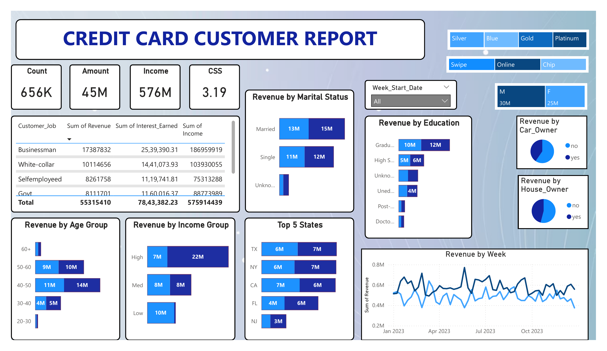
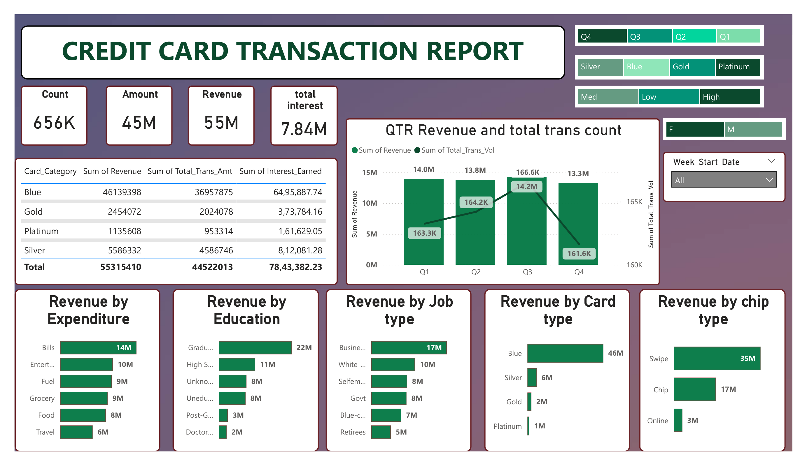

# 📊 Credit Card Weekly Dashboard

## 🎯 Project Objective
To develop a comprehensive credit card weekly dashboard that provides real-time insights into key performance metrics and trends, enabling stakeholders to monitor and analyze credit card operations effectively.

## 🚀 Credit Card Financial Dashboard using Power BI
- Developed an **interactive dashboard** using transaction and customer data from Excel.  
- **Streamlined data processing and analysis** to monitor key performance metrics and trends.  
- Shared **actionable insights** with stakeholders to support data-driven decision-making.

## 🔍 Project Insights
- **💰 Overall revenue:** 57M  
- **📈 Total interest:** 8M  
- **💳 Total transaction amount:** 46M  
- **👥 Revenue contribution by gender:**  
  - Male: 31M  
  - Female: 26M  
- **🏆 Credit card type contribution:**  
  - Blue & Silver cards contribute **93%** of overall transactions  
- **🌎 Top contributing states:**  
  - TX, NY, and CA contribute **68%** of transactions  


  ## 🧮 DAX Queries
The following DAX measures were used to create calculated columns and segment customers:

```dax
AgeGroup = SWITCH(
    TRUE(),
    'public cust_detail'[customer_age] < 30, "20-30",
    'public cust_detail'[customer_age] >= 30 && 'public cust_detail'[customer_age] < 40, "30-40",
    'public cust_detail'[customer_age] >= 40 && 'public cust_detail'[customer_age] < 50, "40-50",
    'public cust_detail'[customer_age] >= 50 && 'public cust_detail'[customer_age] < 60, "50-60",
    'public cust_detail'[customer_age] >= 60, "60+",
    "unknown"
)
Copy code
IncomeGroup = SWITCH(
    TRUE(),
    'public cust_detail'[income] < 35000, "Low",
    'public cust_detail'[income] >= 35000 && 'public cust_detail'[income] < 70000, "Med",
    'public cust_detail'[income] >= 70000, "High",
    "unknown"
)
```
## 🛠️ Tools Used
- **Power BI** for dashboard development  
- **Microsoft Excel** for data preparation and processing  

## 📸 Dashboard Preview

### Customer Report


### Transaction Report



